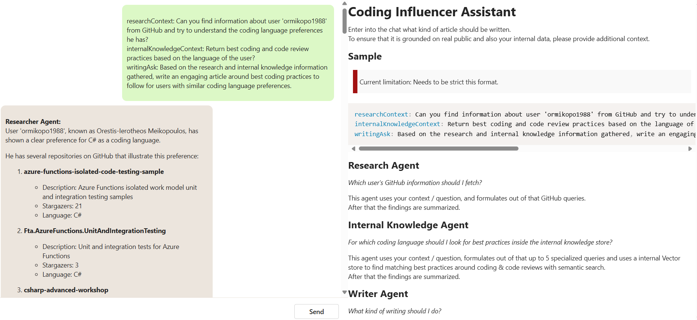
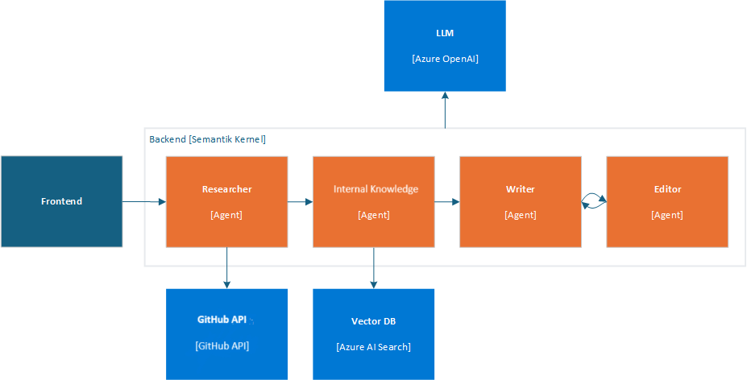
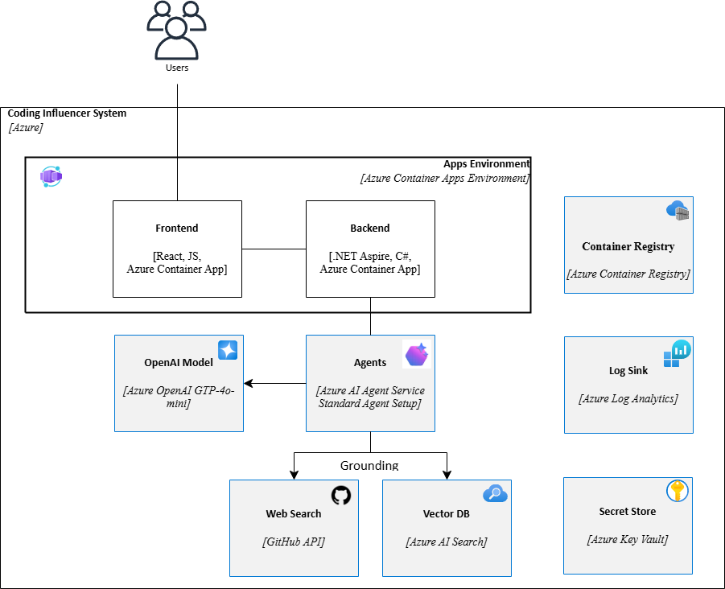

# Coding Influencer Assistant: Working with Agents using Semantic Kernel and .NET Aspire (C#)

This project is a comprehensive example of a chat application built with .NET Aspire, Semantic Kernel, and the `@microsoft/ai-chat-protocol` package. 

The frontend of the application is developed using React and Vite.

Underneath it uses an Azure AI Foundry hub & project, Azure AI Agent Service with a standard agent setup, GitHub API Plugin and Azure AI Search for grounding.

## Features

The application consists of 2 main projects:

- `ChatApp.WebApi`: This is a .NET Web API that handles chat interactions, powered by .NET Aspire and Semantic Kernel. It provides endpoints for the chat frontend to communicate with the chat backend.

- `ChatApp.Client`: This is a React app that provides the user interface for the chat application. It is built using `Vite`. It uses the `@microsoft/ai-chat-protocol` package to handle chat interactions, allowing for flexible communication with the chat backend.





## Getting Started

## Local Development

### Prerequisites for local development

- .NET 9 SDK
- VSCode or Visual Studio 2022 17.12
- [Node.js 22](https://docs.npmjs.com/downloading-and-installing-node-js-and-npm)
- [Azure CLI (az)](https://aka.ms/install-azcli)
- [Azure Developer CLI (azd)](https://aka.ms/install-azd)

### Running the app

If using Visual Studio, open the solution file `ChatApp.sln` and launch/debug the `ChatApp.AppHost` project.

If using the .NET CLI, run `dotnet run` from the `ChatApp.AppHost` directory.

For more information on local provisioning of Aspire applications, refer to the [Aspire Local Provisioning Guide](https://learn.microsoft.com/en-us/dotnet/aspire/deployment/azure/local-provisioning).

> To utilize Azure resources (e.g. OpenAI) in your local development environment, you need to provide the necessary configuration values.  
> <https://learn.microsoft.com/en-us/dotnet/aspire/azure/local-provisioning#configuration>

Example to add into a `secrets.json` file in the `ChatApp.AppHost` directory:

``` json
{
  "Azure": {
    "Tenant": "<Your tenant id>",
    "SubscriptionId": "<Your subscription id>",
    "AllowResourceGroupCreation": true,
    "ResourceGroup": "<Valid resource group name>",
    "Location": "swedencentral",
    "CredentialSource": "InteractiveBrowser" // or "AzureCli"
  }
}
```

If you want to use existing Azure resource, put their endpoints below the Azure section:

```json
{
  "Azure": {
    "Tenant": "<Your tenant id>",
    "SubscriptionId": "<Your subscription id>",
    "AllowResourceGroupCreation": true,
    "ResourceGroup": "<Valid resource group name>",
    "Location": "swedencentral",
    "CredentialSource": "InteractiveBrowser" // or "AzureCli"
  },
  "ConnectionStrings": {
    "openAI": "https://<lorem>.openai.azure.com/",
    "vectorSearch": "Endpoint=https://<lorem>.search.windows.net/;Key=<lorem>;"
  }
}
```

## Azure Deployment



### Prerequisites for deployment

- [Azure CLI (az)](https://aka.ms/install-azcli)
- [Azure Developer CLI (azd)](https://aka.ms/install-azd)
- [Docker Desktop](https://www.docker.com/products/docker-desktop/)

### Instructions

Navigate into `./ChatApp.AppHost/`.

1. Sign in to your Azure account. You'll need to login to both the Azure Developer CLI and Azure CLI:

    i. First with Azure Developer CLI

    ```shell
    azd auth login
    ```

    ii. Then sign in with Azure CLI

    ```shell
    az login --use-device-code
    ```

2. Provision the resources and deploy the code:

    ```shell
    azd up
    ```
    > Disclaimer: Azure AI Service is currently in preview as well as the Semantic Kernel Agent SDKs we are leveraging in this project.

## Sample Internal Knowledge Data

To load sample internal knowledge data into Azure AI Search as vector store, use the Blazor App inside `./src/ChatApp.KernelMemory/` folder.

## Guidance

### Region Availability

This template uses `gpt-4o-mini`, `text-embedding-3-large` and `Azure AI Agent Service` which may not be available in all Azure regions. Check for [up-to-date region availability](https://learn.microsoft.com/azure/ai-services/openai/concepts/models#standard-deployment-model-availability) and select a region during deployment accordingly

- We recommend using *Sweden Central* for this project.

### Costs

You can estimate the cost of this project's architecture with [Azure's pricing calculator](https://azure.microsoft.com/pricing/calculator/)

## Resources

- [Semantic Kernel Documentation](https://learn.microsoft.com/en-us/semantic-kernel/overview/)
- [Semantic Kernel Agent Framework Documentation](https://learn.microsoft.com/en-us/semantic-kernel/frameworks/agent/?pivots=programming-language-csharp)
- [Aspire Documentation](https://learn.microsoft.com/en-us/dotnet/aspire/)

## Credits

- Idea inspired from: [A creative writing multi-agent solution to help users write articles using Aspire and Semantic Kernel](https://github.com/Azure-Samples/aspire-semantic-kernel-creative-writer)